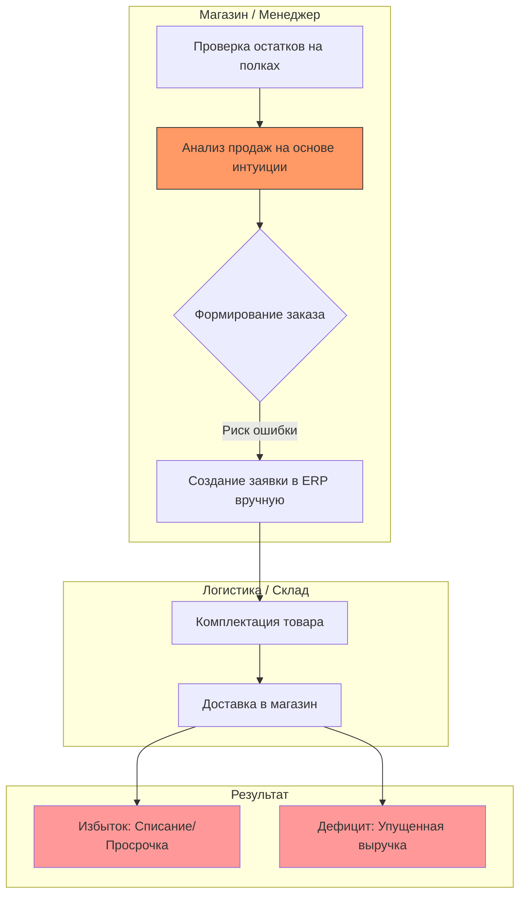
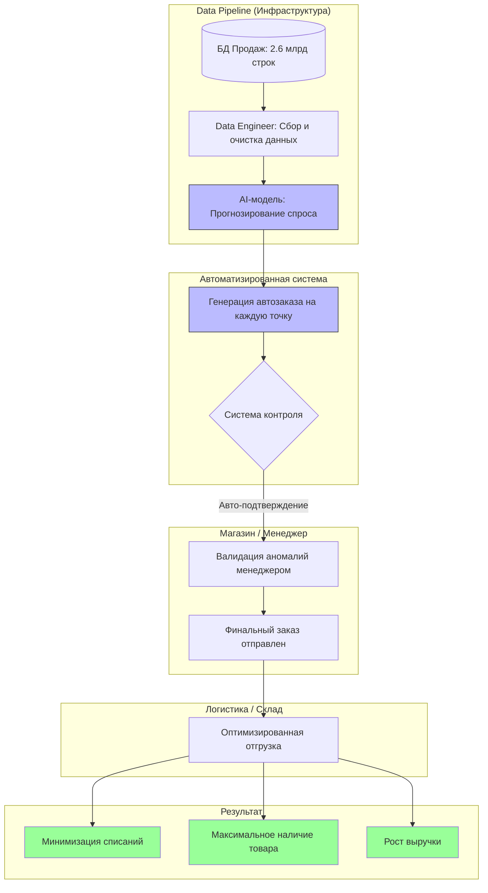
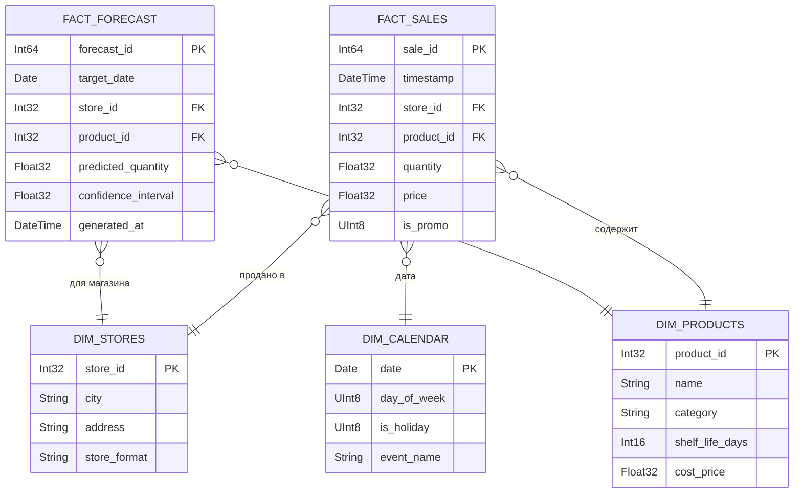
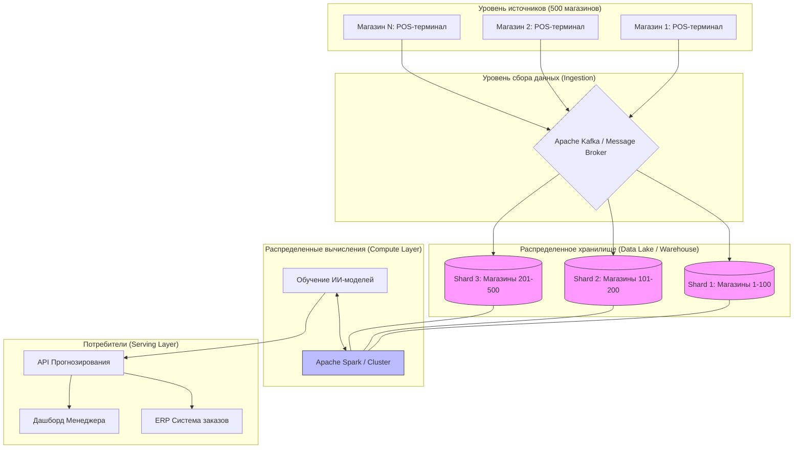
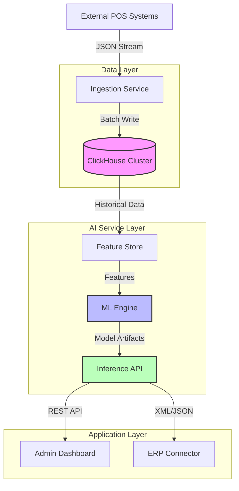
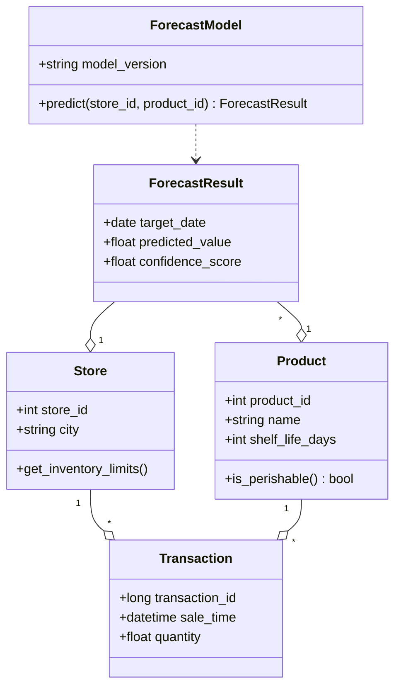
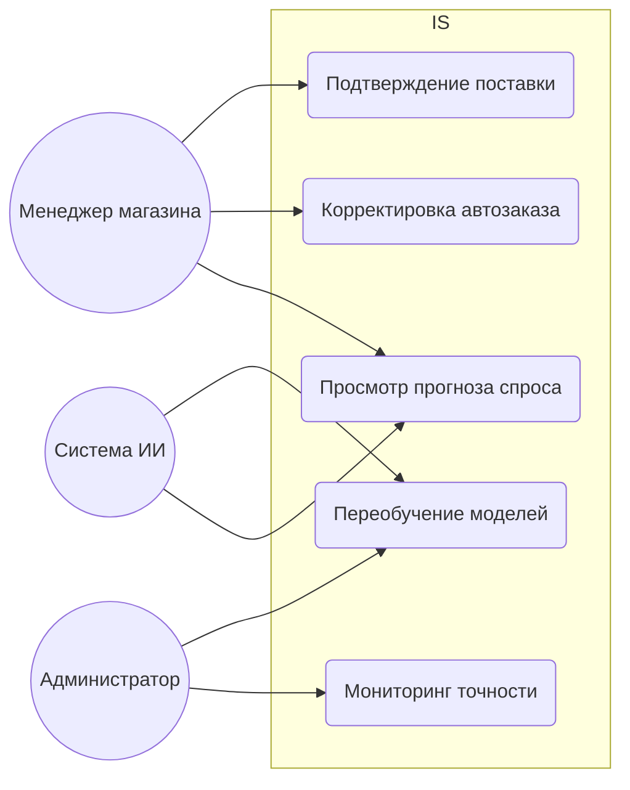
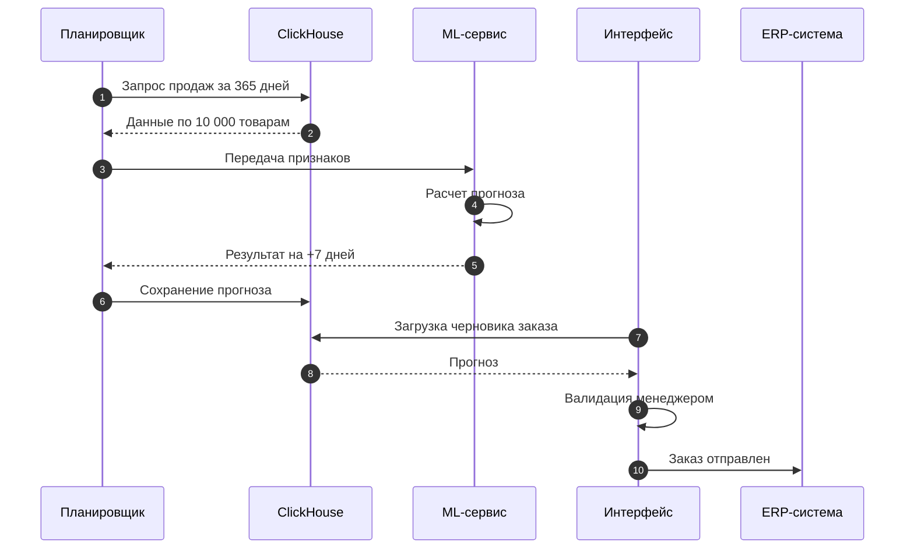
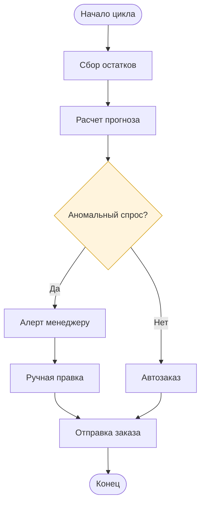

### 1. Модели бизнес-процессов (BPMN/Потоки работ)

#### Модель «AS-IS» (Текущее состояние)

**Описание:** Отражает текущий ручной процесс. Основной акцент сделан на «интуитивном анализе», который является источником ошибок (избытка или дефицита товара) и прямых финансовых потерь.

#### Модель «TO-BE» (Целевое состояние)

**Описание:** Демонстрирует автоматизацию аналитического блока. ИИ заменяет интуицию менеджера, перекладывая рутину на систему и оставляя человеку только функцию контроля аномалий.

---

### 2. Диаграмма структуры данных (ER-диаграмма)

**Описание:** Схема типа «Снежинка» (Snowflake Schema) для OLAP-системы. Разделяет быстрорастущие факты (2.6 млрд транзакций) и справочники (Dimensions), обеспечивая высокую скорость аналитических запросов и обучения моделей.

---

### 3. Диаграмма архитектуры распределенной системы

**Описание:** Показывает распределение данных (шардирование по магазинам) и вычислений (Spark кластер). Это необходимо для параллельной обработки миллиардов строк и обеспечения отказоустойчивости при сбоях отдельных узлов.

---

### 4. Структурные UML-диаграммы

#### UML-диаграмма компонентов

**Описание:** Описывает логическую структуру системы. Разделение на независимые слои (Data, AI, App) позволяет обновлять модели ИИ (ML Engine) без остановки интерфейса пользователя (UI).

#### UML-диаграмма классов

**Описание:** Статическая структура кода. Описывает сущности магазина, товара и транзакции, а также логику взаимодействия модели прогнозирования с результатами.

---

### 5. Поведенческие UML-диаграммы

#### Диаграмма прецедентов (Use Case)

**Описание:** Описывает функциональные возможности системы для разных ролей: менеджера, самой системы ИИ (автономные действия) и администратора.

#### Диаграмма последовательности (Sequence Diagram)

**Описание:** Отражает динамику работы системы во времени: от ночного сбора данных и работы ML-сервиса до утреннего подтверждения заказа менеджером.

#### Диаграмма активностей (Activity Diagram)

**Описание:** Алгоритм принятия решения в системе. Акцентирует внимание на блоке «аномального спроса», где система запрашивает вмешательство человека для снижения рисков.
