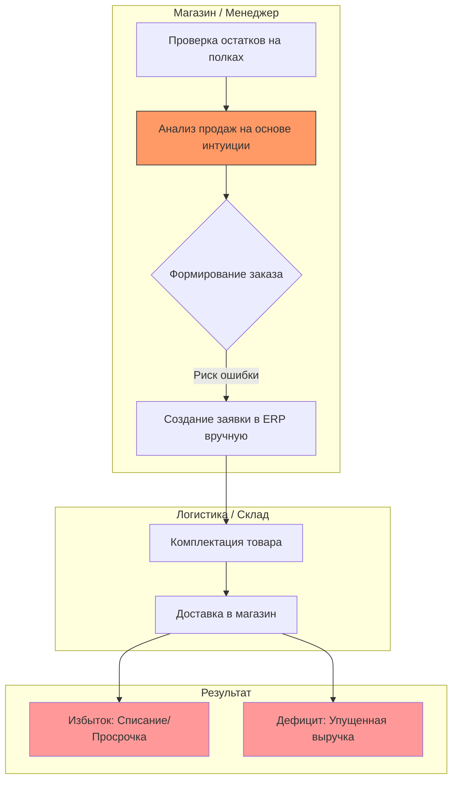
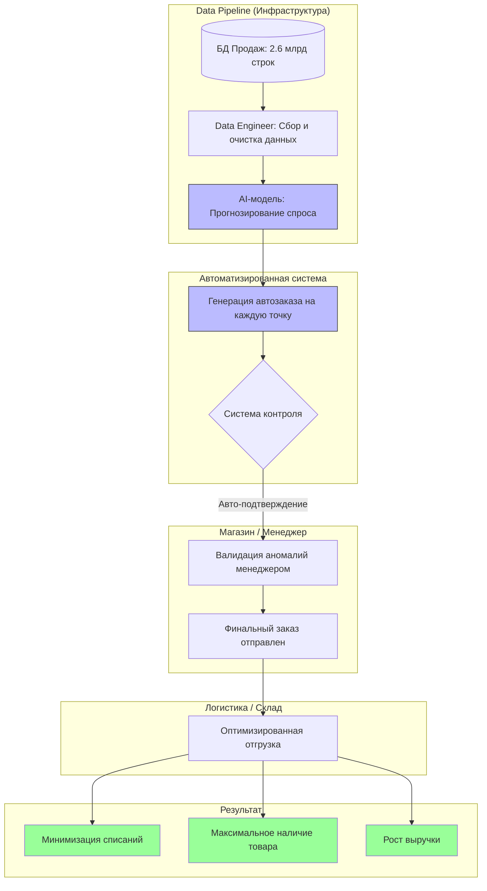
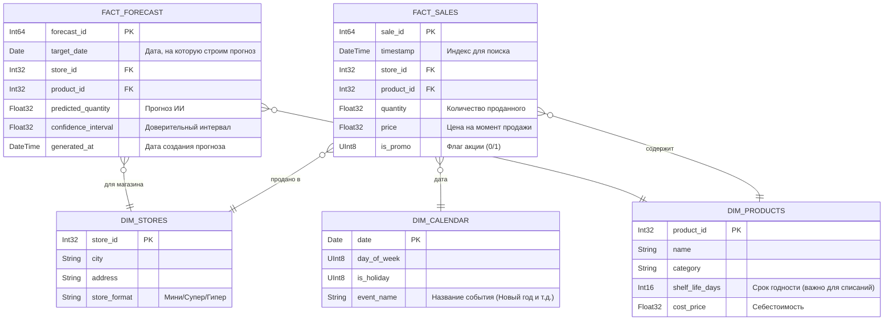
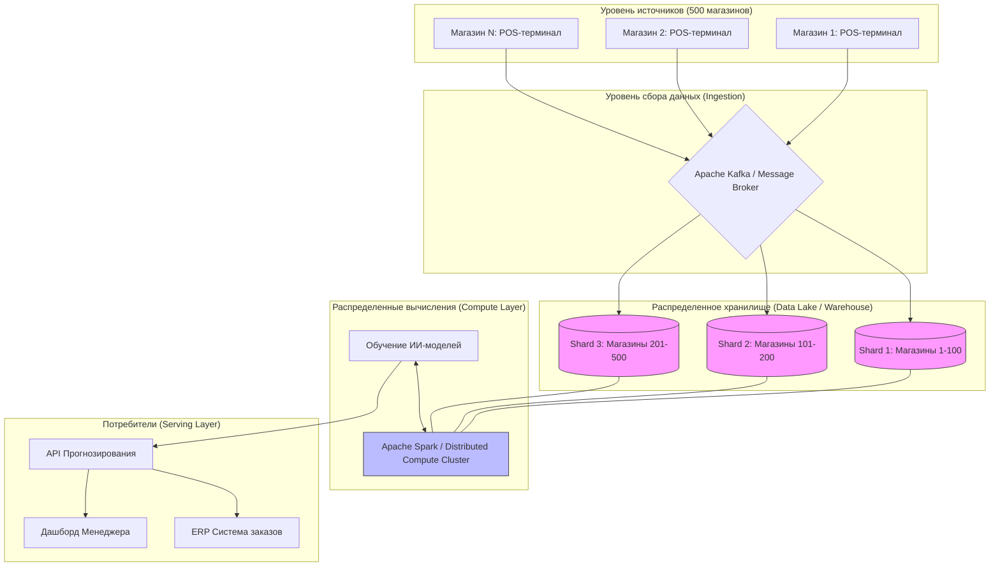
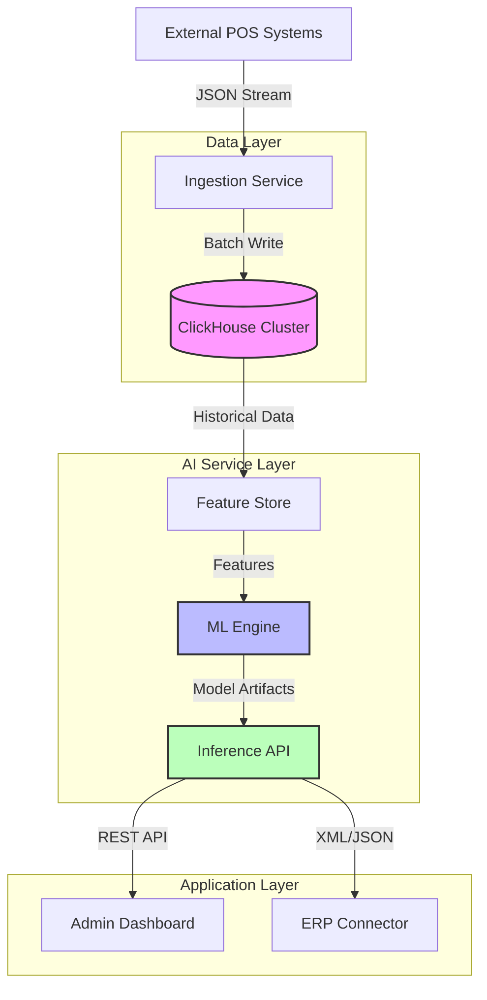
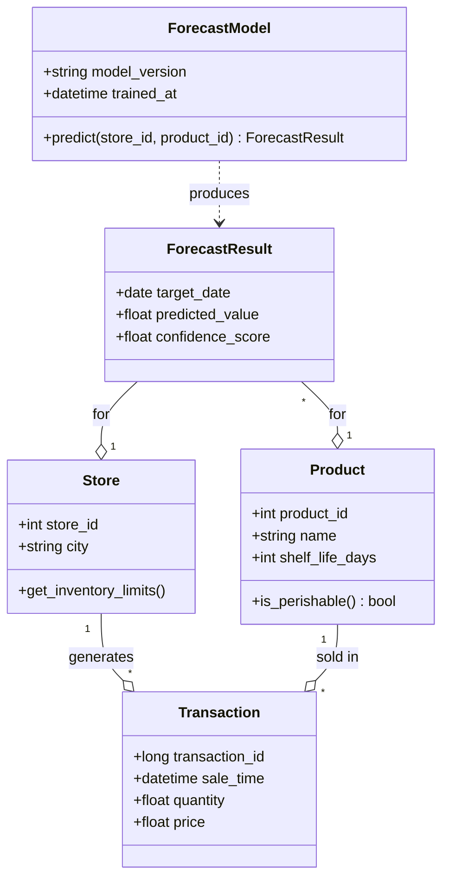
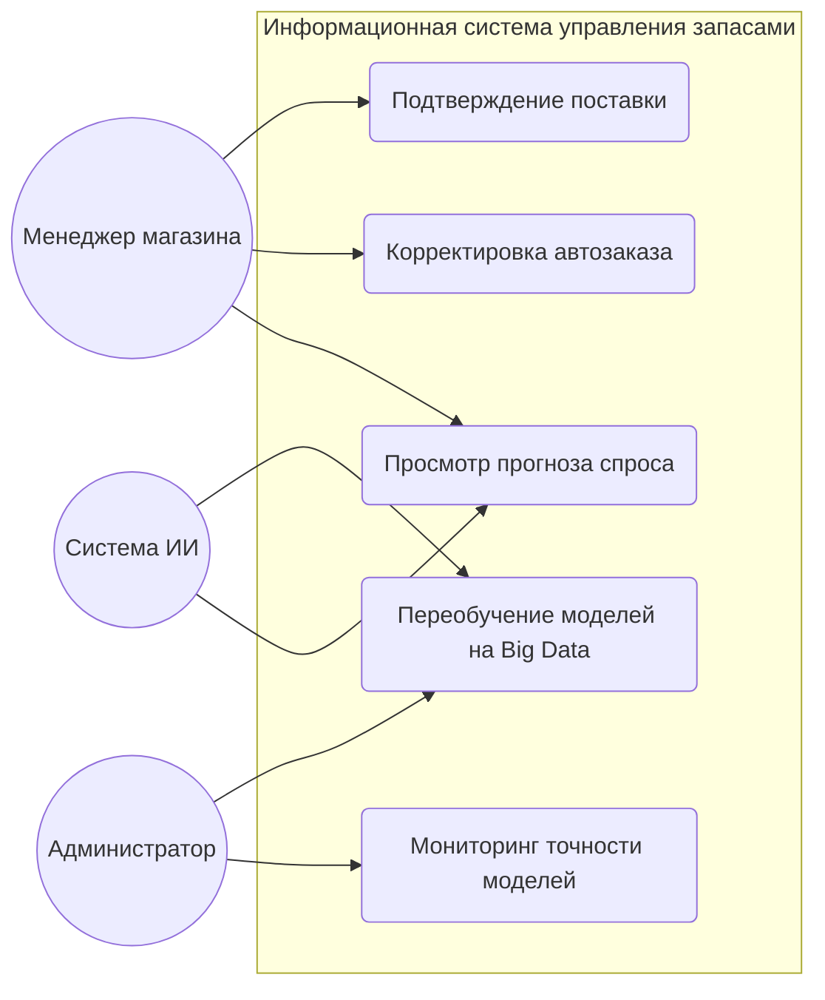
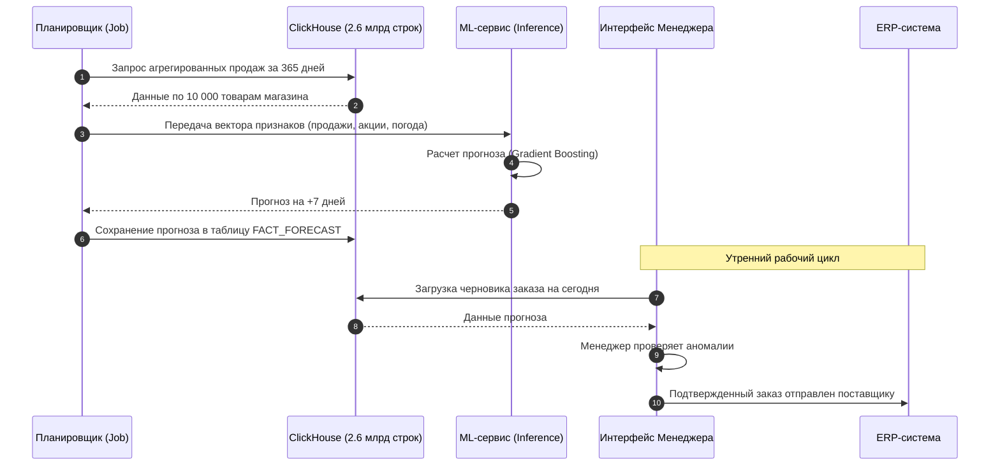
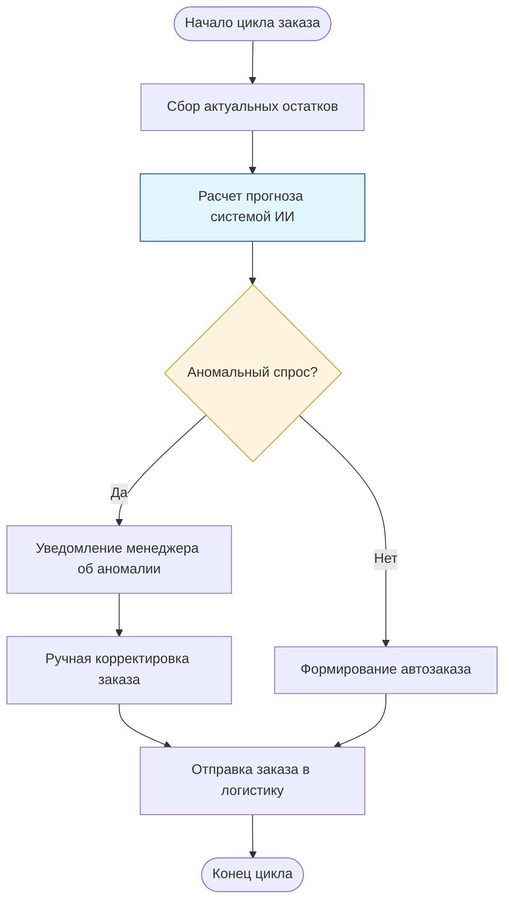

#### Задание 1
модели бизнес процессов до разработки систем и после ее внедрения (в диаграммах IDEF0 или BPMN должно быть акцентировано - что меняет разрабатываемая информационная система в бизнес-процессах);

##### Как есть сейчас («AS-IS»)
В этой модели основным узким местом является «человеческий фактор» и отсутствие глубокой аналитики.

**Ключевые проблемы процесса:**

- **Субъективность:** Менеджер не может учесть 10 000 товаров одновременно.
- **Локальность:** Менеджер не видит общих трендов сети.
- **Трудозатраты:** Огромное количество времени тратится на рутинный ввод данных.

##### После внедрения ИИ («TO-BE»)

Система ИИ берет на себя тяжелую аналитическую работу, оставляя человеку роль контролера.

Система проектируется с учетом высокой нагрузки: обработка 2,67 млрд событий требует применения технологий распределенных вычислений. Автоматизация позволит масштабировать процесс управления на все 500 магазинов без увеличения штата аналитиков.

**Итог внедрения:** Менеджер магазина перестает быть «счетчиком» и становится «контролером», а система превращает накопленные данные из пассивного груза в активный инструмент увеличения прибыли.

| Параметр процесса | Текущее состояние (AS-IS) | После внедрения ИИ (TO-BE) | Роль ИИ-системы и команды |
| :--- | :--- | :--- | :--- |
| **Объем анализируемых данных** | Ограничен памятью менеджера и короткими отчетами (субъективно). | Полный анализ 2.67 млрд транзакций за год по всей сети. | **Data Engineer:** Обработка и подготовка Big Data пайплайнов. |
| **Метод прогнозирования** | Интуитивный: «на глаз» или по продажам прошлой недели. | Математический: учет сезонности, трендов и внешних факторов. | **Data Scientist:** Разработка и обучение прогнозных моделей. |
| **Скорость формирования заказа** | Низкая: ручной выбор позиций и ввод количества для 10 000 товаров. | Высокая: мгновенная генерация автозаказа на основе прогноза. | **Software Architect:** Автоматизация и интеграция с ERP-системой. |
| **Точность запасов (Stockout / Overstock)** | Высокие потери: списание просрочки (молоко) или пустые полки. | Оптимальный запас: минимизация излишков и дефицита. | **Product Owner:** Настройка бизнес-метрик (KPI) и приоритетов системы. |
| **Роль персонала в магазине** | Исполнитель: тратит часы на рутинные расчеты и ввод данных. | Контролер: тратит минуты на проверку и подтверждение аномалий. | **Система:** Высвобождение человеческого ресурса для работы в зале. |
| **Масштабируемость** | Сложная: найм и обучение новых менеджеров для каждой точки. | Линейная: система одинаково эффективно работает на 500 и на 5000 магазинов. | **Data Architect:** Проектирование масштабируемой архитектуры данных. |
| **Учет связей** | Локальный: менеджер видит только свой магазин. | Глобальный: учет логистических цепочек и спроса во всей сети. | **Data & Software Architect:** Создание единого информационного контура. |

#### Задание 2. Модель структуры данных и обоснование выбора БД

##### 2.1. Выбор типа базы данных
Для реализации системы выбрана **колоночная аналитическая СУБД (OLAP)**, предпочтительно **ClickHouse** или аналоги (Google BigQuery, Snowflake).

- **Объем данных:** 2,67 млрд записей в год — это ~7,3 млн транзакций в день. Обычные реляционные БД (PostgreSQL/MySQL) будут выполнять аналитические запросы довольно долго(минутами или часами). Колоночные БД делают это сильно быстрее. 
- **Сжатие:** Поскольку данные однотипны, колоночное хранение позволяет сжимать базу в 5–10 раз, экономя место.
- **Эффективность для ИИ:** Модели машинного обучения требуют пакетной выгрузки признаков (features). OLAP-системы оптимизированы для чтения больших диапазонов данных.

##### 2.2. Инфологическая модель данных
В основе системы лежит архитектура **Snowflake Schema**, которая минимизирует дублирование и обеспечивает высокую скорость обработки временных рядов.

**Основные сущности:**
1.  **Таблица фактических продаж (FACT_SALES):** Центральная таблица, содержащая все 2.67 млрд транзакций.
2.  **Таблица фактов прогноза:** Результаты работы ИИ-модели.
3.  **Справочник товаров:** 10 000 уникальных позиций.
4.  **Справочник точек продаж:** 500 магазинов.
5.  **Справочник времени:** Содержит метаданные дат (праздники, выходные, рабочие дни).

##### 2.3. ER-диаграмма

##### 2.4. Стратегия масштабирования и оптимизации

Учитывая гигантский объем данных (2.67 млрд строк), в дизайне системы заложены следующие решения:
1.  **Партиционирование :** Таблица `FACT_SALES` разбивается на разделы по месяцам. Это позволяет ИИ-модели быстро считывать только свежие данные за последний год, не затрагивая архивные.
2.  **Шардирование:** Данные распределяются между несколькими серверами по `store_id`. Таким образом, запросы по 500 магазинам могут обрабатываться параллельно.
3.  **Материализованные представления:** Для ускорения работы ИИ создаются предварительно агрегированные таблицы (например, "продажи по дням"), что сокращает объем данных для обучения с миллиардов до миллионов строк.

#### Задание 3. Архитектура распределенной системы обработки данных

Архитектура построена по принципу Lambda-архитектуры (разделение на быстрый слой для оперативных остатков и пакетный слой для глубокого обучения ИИ на истории за год).

##### 3.1. Обоснование распределенного характера системы

Работа с данными носит распределенный характер по следующим причинам:
- Объем: 2,67 млрд транзакций в год требуют терабайты дискового пространства. Распределение данных по нескольким узлам (шардирование) позволяет обрабатывать запросы параллельно.
- География: Данные генерируются в 500 точках продаж. Первичная обработка может происходить локально или в региональных хабах перед отправкой в центральное хранилище.
- Отказоустойчивость: Распределенное хранение (репликация) гарантирует, что при выходе из строя одного сервера система не потеряет данные о продажах и продолжит выдавать прогнозы.

##### 3.2. Диаграмма архитектуры 
Для визуализации используем схему потоков данных от магазинов до ИИ-модели.

##### 3.3. Описание компонентов архитектуры
- Data Sharding: Данные распределяются по узлам кластера по ключу store_id. Это значит, что запросы на прогноз для Магазина №1 и Магазина №500 будут обрабатываться разными физическими серверами одновременно.
- Apache Kafka: Выступает в роли «буфера». Поскольку 500 магазинов шлют данные непрерывно, Kafka позволяет сглаживать пиковые нагрузки (например, в предновогодние часы) и гарантирует доставку каждого чека в хранилище.
- Distributed Compute (Spark): Обучение ИИ-модели на 2,6 млрд строк на одном компьютере заняло бы недели. Распределенный кластер разбивает задачу на части: каждый сервер считает статистику по своей группе магазинов, а затем результаты объединяются.
- Serving Layer (API): Итоговый прогноз — это небольшая по объему информация (всего 10 000 чисел на магазин). Она хранится в оперативной памяти (Redis) для мгновенного доступа менеджеров через интерфейс.

##### 3.4. Соответствие структуре данных
- Справочники (Dimensions): (Товары, Магазины) реплицируются (копируются полностью) на каждый узел, чтобы обеспечить быструю связь (JOIN) с фактами продаж без пересылки данных по сети.
- Факты (Facts): (Транзакции) шардируются (режутся на части) по узлам для обеспечения горизонтального масштабирования.

#### Задание 4. Структурная UML-диаграмма компонентов и UML-диаграмма классов

##### 4.1. UML-диаграмма компонентов 

Описание диаграммы: 
1) система разделена на независимые слои (Data, AI, App)
2) лой Data Layer отвечает за прием данных из магазинов и их хранение в ClickHouse.
3) Слой AI Service Layer изолирован, что позволяет переобучать модели без изменения кода интерфейса.

Описание компонентов:
1) Ingestion Service: Принимает данные из 500 магазинов в реальном времени.
2) ClickHouse Cluster: Распределенное хранилище для 2.67 млрд записей.
3) ML Engine: Модуль на Python (PySpark/Scikit-learn), отвечающий за обучение моделей.
4) Inference API: Микросервис, который выдает готовые прогнозы по запросу.
5) ERP Connector: Модуль интеграции с существующей системой заказов сети.

##### 4.2. UML-диаграмма классов

Описание ключевых связей:
1) Store & Product: Являются базовыми сущностями. 
2) Transaction: Сущность, описывающая факт продажи. Связана с конкретным магазином и товаром. 
3) ForecastModel: Класс, инкапсулирующий логику ИИ. Метод predict принимает ID магазина и товара, возвращая объект прогноза.
4) ForecastResult: Объект, содержащий предсказание на конкретную дату с оценкой уверенности модели.

#### Задание 5. Поведенческие модели системы

##### 5.1. Use Case Diagram

Описание:
1) Менеджер магазина: Основной пользователь, который работает с результатами прогноза и подтверждает финальные заказы.
2) Система ИИ: Выступает как автономный актор, который генерирует данные для просмотра и инициирует циклы самообучения.
3) Администратор: Следит за качеством моделей и техническим состоянием пайплайнов данных.

Зачем нужна Диаграмма прецедентов: Она четко разделяет ответственность. Менеджер не занимается математикой — он принимает управленческие решения. Система ИИ работает в фоновом режиме, обеспечивая данными.

##### 5.2. Диаграмма последовательности (Sequence Diagram)
Эта диаграмма показывает процесс формирования ежедневного прогноза для одного магазина. Она идеально демонстрирует, как данные из хранилища превращаются в решение.

Зачем нужна Диаграмма последовательности: Она подчеркивает роль распределенного хранилища (ClickHouse). Мы показываем, что перед расчетом ИИ система делает запрос к истории из 2,6 млрд записей, чтобы учесть долгосрочную сезонность.

##### 5.3. Диаграмма активностей (Activity Diagram)

На схеме активностей видно «петлю контроля». Если ИИ предсказывает аномально высокий спрос (например, внезапный наплыв туристов), система не заказывает товар слепо, а выводит предупреждение человеку. Это предотвращает финансовые риски.