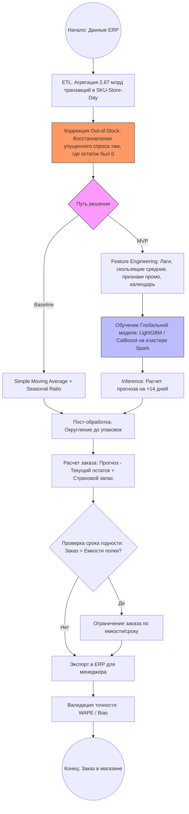

# Кейс №3
## Выполнили: Архангельская Елизавета, Данилова Анастасия 

**Бизнес-цель:** Оптимизировать управление товарными запасами и логистикой путем точного прогнозирования спроса на товары в каждой точке продаж сети супермаркетов.

**Описание текущего процесса:**
Сейчас заказы товаров формируются вручную на основе интуиции менеджеров → частые ошибки (избыток/дефицит) ведут к потерям из-за просроченных товаров (молоко, хлеб) или упущенной выручки при отсутствии товара (спрос есть, продавать нечего).
Руководство сети хочет автоматизировать процесс управления запасами и логистикой, чтобы уменьшить ошибки и увеличить выручку. В качестве данных предполагается использование накопленной статистики по продажам каждого товара в каждом магазине за последний год.

Количество уникальных товаров в сети - 10 000. Количество магазинов - 500. Количество продаж за последний год по всей сети - 2 670 000 000

### Распределение ролей внутри команды 

**Елизавета:** Data Architect + Data Engineer

Задачи:
- Проектирование хранилища: Где и как хранить 2,6 млрд записей (выбор между Hadoop/Spark, ClickHouse или облачными решениями типа BigQuery/Snowflake).
- ETL-процессы: Сбор данных из 500 магазинов, их очистка, агрегация и приведение к единому формату.
- Производительность: Сделать так, чтобы расчет прогноза на 10 000 товаров не занимал неделю.
- Интеграция: Проектирование того, как предсказания модели будут попадать в систему заказов супермаркетов (API, экспорт в ERP-систему).

**Анастасия:** Product Owner + Data Scientist 

Задачи:
- Бизнес-логика (PO): Определение приоритетов. Что важнее: не допустить списания молока или не допустить отсутствия дорогого алкоголя? Общение с директорами магазинов.
- Анализ данных: Поиск закономерностей (сезонность, праздники, влияние акций, «эффект выходного дня»).
- Разработка моделей ИИ (DS): Выбор и обучение алгоритмов (Time Series, Gradient Boosting, или нейросети).
- Валидация: Проверка точности прогноза на исторических данных (бэктестинг). 

### 1. Цели и предпосылки

#### 1.1. Зачем идем в разработку продукта?

**Бизнес-цель:**
Основная цель — трансформация системы управления товарными запасами из реактивной (исправление ошибок по факту) в предиктивную (упреждающее управление). Мы стремимся минимизировать операционные издержки, связанные с неэффективным использованием оборотного капитала, заблокированного в излишках товара, и одновременно исключить потери выручки из-за пустых полок. В цифрах это означает создание масштабируемого решения для 500 магазинов, которое работает круглосуточно и без человеческого фактора.

**Почему станет лучше, чем сейчас, от использования ML:**
Текущий процесс «на основе интуиции» принципиально не справляется с масштабом сети.
1.  **Масштабируемость:** Человек не способен ежедневно анализировать 5 000 000 комбинаций «товар-магазин» (10 000 товаров × 500 точек). ML-модель делает это автоматически за несколько часов.
2.  **Глубина анализа:** Человек видит только верхушку айсберга (продажи вчера/сегодня). ML-система учитывает скрытые закономерности в 2,67 млрд исторических транзакций: сложную сезонность, влияние промо-акций, «эффект выходного дня» и другое.
3.  **Снижение человеческого фактора:** Прогноз ML объективен.
4.  **Скорость:** Переход от ручного заполнения заявок к системе «автозаказа» сокращает время подготовки заказа менеджером с часов до минут, позволяя персоналу сфокусироваться на работе с покупателями.

**Что будем считать успехом итерации с точки зрения бизнеса:**
Для первой итерации (MVP) успехом будут считаться следующие показатели:
*   **Снижение объема списаний:** Сокращение потерь товаров категории Fresh (молоко, хлеб, овощи) на 15% в пилотных магазинах.
*   **Повышение доступности:** Снижение случаев отсутствия товаров на полке на 10% по ключевым позициям.
*   **Экономический эффект:** Увеличение чистой прибыли сети за счет высвобождения оборотного капитала и роста выручки (при спросе есть товар для продажи).
*   **Точность прогноза:** Достижение средней ошибки прогнозирования не более 15–20% на уровне категории товара.

####  1.2. Бизнес-требования и ограничения
##### 1.2.1. Краткое описание бизнес-требований (БТ)
- Автоматизация прогноза: Система должна ежедневно генерировать прогноз спроса на следующие 7–14 дней для каждой товарной позиции в каждом магазине.
- Интеграция с ERP: Результаты прогноза должны автоматически конвертироваться в черновики заказов в существующей системе управления сетью.
- Интерфейс корректировки: Менеджеры магазинов должны иметь возможность просматривать прогноз и вносить ручные правки.
- Обработка исторических данных: Система должна учитывать данные о продажах, остатках, ценах и промо-акциях за последние 12 месяцев (2,67 млрд записей).

##### 1.2.2. Бизнес-ограничения
- Технологический стек: Внедрение системы не должно требовать полной замены кассового ПО в магазинах; данные собираются из центрального хранилища.
- Регламентное время: Расчет прогноза на всю сеть (10 000 товаров × 500 магазинов) должен занимать не более 4 часов, чтобы заказы были готовы к 07:00 утра.
- Стоимость владения (TCO): Затраты на облачную инфраструктуру или серверные мощности для обработки Big Data не должны превышать 10% от прогнозируемой экономии на списаниях.
- Юридические нормы: Система не должна обрабатывать персональные данные покупателей, только деперсонализированные логи транзакций.

##### 1.2.3. Что мы ожидаем от конкретной итерации (MVP)
В рамках первой итерации мы создаем работающий прототип системы (MVP) для:
- Одной товарной категории: "Fresh" (молоко, хлеб, мясо), как наиболее критичной для прибыли.
- Ограниченного количества точек: 10 тестовых супермаркетов в разных регионах.
- Проверки базовой гипотезы: "Модель ИИ предсказывает спрос точнее, чем опытный менеджер".

##### 1.2.4. Описание бизнес-процесса пилота
Пилотный процесс строится по схеме "Human-in-the-loop" (Человек в контуре контроля):
- 02:00 – 05:00: Система ИИ собирает данные за прошлые сутки и пересчитывает прогноз.
- 06:00: В ERP-системе магазина появляется "Черновик заказа", помеченный как "Создан ИИ".
- 07:00 – 08:00: Менеджер магазина заходит в систему, видит рекомендованный объем (например, 50 пакетов молока) и нажимает кнопку "Подтвердить" или корректирует значение.
- 08:30: Заказ уходит поставщику.
- Анализ: Вечером система сравнивает: а) Сколько заказал ИИ. б) Сколько поправил человек. в) Сколько реально купили.

##### 1.2.5. Критерии успешного пилота и пути развития
**Критерии успеха:**
- Точность: Прогноз ИИ совпадает с реальными продажами на 80% и более.
- Лояльность: Менеджеры подтверждают более 70% рекомендаций ИИ без правок.
- Экономика: Снижение списаний в 10 пилотных магазинах минимум на 10% относительно аналогичного периода прошлого года.

**Пути развития проекта:**
- Масштабирование: Раскатка системы на все 500 магазинов и 10 000 товаров.
- Автономность: Переход к "автозаказу без подтверждения" для категорий с длительным сроком хранения (бакалея, бытовая химия).
- Оптимизация логистики: Подключение данных о загрузке грузовиков, чтобы ИИ оптимизировал не только объем товара, но и стоимость его доставки.

#### 1.3. Что входит в скоуп проекта/итерации, что не входит

##### 1.3.1. На закрытие каких БТ подписываемся в данной итерации
В текущем MVP работа фокусируется на создании ядра прогнозной системы:
*   **Разработка базового алгоритма:** Создание модели машинного обучения для прогнозирования спроса (например, на базе LightGBM или CatBoost).
*   **Генерация признаков (Feature Engineering):** Учет истории продаж, цен, календарных признаков (выходные, праздники) и факта участия товара в промо-акциях.
*   **Оценка точности:** Валидация модели на исторических данных за последние 3 месяца.
*   **Пилотная категория:** Прогнозирование только для категории **Fresh** (молоко, хлеб, мясо), так как она критична для списаний.

##### 1.3.2. Что не будет закрыто
*   **Холодный старт:** Прогнозирование для абсолютно новых товаров без истории продаж или новых магазинов.
*   **Динамическое ценообразование:** Система не будет предлагать изменение цены для стимуляции спроса.
*   **Глобальный форс-мажор:** Учет непредсказуемых внешних факторов.

##### 1.3.3. Качество кода и воспроизводимость
*   **Контроль версий:** Весь код разработки хранится в Git.
*   **Воспроизводимость данных:** Использование Data Version Control для фиксации версий обучающих выборок.
*   **Контейнеризация:** Решение поставляется в виде Docker-образа, что гарантирует идентичность работы модели в среде разработки и в продакшене.
*   **Логирование:** Использование **MLflow** для трекинга всех экспериментов, метрик и версий моделей.

##### 1.3.4. Планируемый технический долг
*   **Автоматическое переобучение:** В MVP переобучение модели запускается вручную; автоматический пайплайн (CI/CD для ML) — задача следующей итерации.
*   **Feature Store:** На этапе пилота признаки считаются «на лету» в SQL; создание отдельного хранилища признаков (Feature Store) для ускорения вычислений вынесено в бэклог.
*   **Сложные ансамбли:** Используется одна устойчивая модель вместо тяжелого ансамбля из 10+ моделей для экономии времени на инференс (расчет).

#### 1.4. Предпосылки решения

##### 1.4.1. Используемые блоки данных
Для обеспечения точности при объеме 2,67 млрд строк используем:
*   **Транзакционные данные:** Чековая информация (дата, магазин, товары, количество).
*   **Мастер-данные:** Справочники товаров (категория, срок годности) и магазинов (геолокация, формат).
*   **Маркетинговые данные:** Календарь промо-акций (прошлых и будущих).
*   **Внешние данные:** Производственный календарь РФ (праздники и переносы выходных).

##### 1.4.2. Гранулярность модели
*   **Целевая переменная:** Суммарные продажи единицы товара в конкретном магазине за сутки.
*   **Уровень:** **SKU — Store — Day** (Товар — Магазин — День). Это самая высокая степень детализации, необходимая для точного управления полкой.

##### 1.4.3. Горизонт прогноза
*   **Глубина:** 14 дней.
*   **Обоснование:** Большинство товаров категории Fresh поставляются ежедневно или раз в 2-3 дня. 14-дневный горизонт позволяет логистическому центру планировать закупки у производителей заранее.

##### 1.4.4. Метрики качества (Технический KPI)
В качестве основной метрики используется **WAPE (Weighted Average Percentage Error)**:
$$WAPE = \frac{\sum |Actual - Forecast|}{\sum Actual}$$
*Обоснование:* В отличие от обычной ошибки, WAPE взвешивает товары по объему продаж.

##### 1.4.5. Подход к моделированию
Использование **обучения на панельных данных**: вместо создания 5 000 000 отдельных моделей (для каждой пары товар-магазин), строится одна или несколько глобальных моделей, которые учатся на всем массиве данных, используя ID магазина и ID категории как признаки. Это позволяет модели «переносить» знания о поведении товаров между похожими магазинами.

### 2. Методология 

С технической точки зрения задача классифицируется как регрессия временных рядов (Time Series Regression). Мы предсказываем непрерывную величину — объем продаж в штуках/килограммах для каждой пары «товар-магазин» на конкретную дату.
**Ключевой подход:**
**Глобальная модель:** Cтроим одну или несколько глобальных моделей. Эти модели учатся на всем массиве данных (2,67 млрд строк), извлекая общие закономерности поведения категорий товаров во всей сети.
**Обработка временных рядов как табличных данных:** Превращаем временной ряд в набор признаков (лагов, скользящих средних, календарных фичей), что позволяет использовать мощь классического машинного обучения на огромных объемах данных.

#### 2.1. Данные для построения 
Для построения работающей модели данные делятся на «критические» (без которых проект невозможен) и «дополнительные» (улучшающие точность).

**Критические:**
1. Исторические продажи (Sales History):
    - Что именно: Дата, ID магазина, ID товара, количество проданного товара (в минимальных единицах измерения), цена продажи.
    - Зачем: Это целевая переменная для обучения модели.
2. Данные о товарных остатках (Stock Levels/Out-of-stock):
    - Что именно: Ежедневные остатки каждого товара в каждом магазине.
    - Почему это критично: Если товара не было на полке (остаток = 0), то продажи будут нулевыми, даже если спрос был огромным. Без этих данных модель решит, что «товар не покупают», и предложит заказать еще меньше, создавая порочный круг дефицита. Это называется проблемой цензурированных данных.
3. Справочники (Master Data):
    - Что именно: Категория товара, срок годности, формат магазина, регион.
    - Зачем: Позволяет модели обобщать знания. Если данных по конкретному йогурту мало, модель «подсмотрит» поведение всей категории йогуртов в этом регионе.
4. Календарь промо-акций (Marketing Calendar):
    - Что именно: Период акции, тип скидки, механика (1+1, купон и т.д.).
    - Зачем: В ритейле промо может увеличивать спрос в 2–10 раз. Без знания о будущих акциях модель катастрофически ошибется в прогнозе.

**Дополнительные данные:**
1. Календарь событий: Праздники, переносы выходных, крупные городские мероприятия рядом с магазинами.
2. Погода: Особенно актуально для категорий «мороженое», «напитки», «гриль».
3. Данные о списаниях: Сколько товара было выброшено из-за просрочки (помогает точнее откалибровать штраф модели за перепоставку).

#### 2.2. Блок-схема решения 

**Описание этапов решения:**

1. Подготовка данных и архитектура Бейзлайна 
    *   **Архитектура бейзлайна:** Используется статистический метод — скользящее среднее за последние 7 дней, умноженное на коэффициент сезонности прошлого года. 
    *   **Зачем:** Это дешево в расчете и дает точку отсчета. Если ML-модель не бьет точность простого среднего, значит, она переобучена или данные зашумлены.

2. Построение прогнозных моделей 
    *   **Feature Engineering:** Для 10 000 товаров создаются лаги (продажи 1, 7, 14, 28 дней назад) и категориальные признаки (бренд, тип упаковки).=

3. Оптимизация и бизнес-ограничения
    *   **Учет Fresh-категории:** Система проверяет: если прогноз на неделю 100 единиц, а срок годности товара всего 3 дня, система принудительно дробит заказ, чтобы избежать списаний.

4. Тестирование и подготовка пилота
    *   **Backtesting:** Модель запускается на данных прошлого года. Мы сравниваем: сколько заказала бы модель и сколько реально продалось.
    *   **Подготовка пилота:** Интеграция с интерфейсом менеджера, чтобы он видел рекомендацию ИИ.

5. Закрытие технического долга 
    *   Переход от ручного запуска скриптов к **Airflow DAGs**.
    *   Автоматизация мониторинга **Data Drift** (если поведение покупателей резко изменилось, система должна подать сигнал о необходимости переобучения).

### 3. Подготовка пилота

#### 3.1. Способ оценки пилота
Для оценки эффективности системы будет использован метод **контрольных групп (Matched Pairs A/B Testing)**. 

*   Из 500 магазинов выбираются 20 пар максимально похожих объектов (по формату, локации и товарообороту). В каждой паре один магазин становится **Тестовым** (заказы формирует ИИ), а второй — **Контрольным** (заказы формируются вручную, как раньше).
*   **Длительность:** 4–8 недель (минимум два полных цикла закупок для товаров с длительным сроком хранения и ежедневный цикл для категории Fresh).
*   **Сравнение:** Мы сравниваем не абсолютные продажи, а разницу изменений метрик в тестовой группе относительно контрольной. Это исключает влияние общих рыночных факторов (например, праздников или сезонного спада спроса).

#### 3.2. Что считаем успешным пилотом
Успех пилота определяется достижением целевых значений по трем группам метрик:

1.  **Бизнес-метрики:**
    *   **Снижение объема списаний:** Минимум -15% в категории Fresh.
    *   **Снижение упущенных продаж:** Минимум -10% по ключевым позициям .
    *   **Оборачиваемость:** Сокращение среднего срока хранения товара на складе магазина на 5%.

2.  **Операционные метрики:**
    *   **Коэффициент принятия:** Менеджеры подтверждают без изменений более 75% заказов, предложенных ИИ.
    *   **Время на заказ:** Сокращение времени менеджера на формирование ежедневной заявки в 3 и более раз.

3.  **Технические метрики:**
    *   **WAPE:** Средневзвешенная ошибка прогноза на уровне магазина не превышает 20%.
    *   **Bias:** Модель не должна систематически занижать прогноз (что ведет к дефициту) или завышать его (что ведет к списаниям). Допустимый коридор: ±5%.

#### 3.3. Подготовка пилота и вычислительные затраты
Обработка 2,67 млрд транзакций требует значительных ресурсов, поэтому подготовка пилота включает этап оптимизации вычислительной сложности.

**План оценки сложности:**
1.  **Эксперимент на бейзлайне:** Запуск простого скользящего среднего на полном объеме данных. Это позволит замерить «стоимость» чтения 2,6 млрд строк из хранилища и определить лимиты.
2.  **Ограничение для пилота:** Чтобы не тратить бюджет на обсчет всей сети во время теста, для пилота будет использоваться **фильтрация данных**: обучение модели будет проходить на данных всей сети, но расчет прогноза — только для 20 пилотных магазинов.
3.  **Вычислительный бюджет:** 
    *   Для обучения используется временный кластер.
    *   Для ежедневного прогноза выделяется минимальная мощность, так как расчет 10 000 прогнозов на 20 магазинов — это легкая задача (в отличие от обучения).
4.  **Установка ограничений:** Если стоимость одного цикла переобучения модели превысит расчетную выгоду от списаний за день, мы применим методы **агрегации данных** (переход от чеков к дневным суммам на уровне ETL) или сократим глубину истории для обучения с 365 до 180 дней.

### 4. Внедрение для production систем

!!! #### 4.1. Архитектура решения

#### 4.5. Безопасность данных

1. Система не использует персональные данные (ФИО, телефоны или адреса), работая исключительно с деперсонализированными ID транзакций и товаров, что полностью исключает нарушения GDPR и законов о персональных данных.
2. Безопасность обеспечивается хранением данных во внутреннем защищенном контуре компании с использованием шифрования при передаче информации между магазинами и центральным сервером.
3. Доступ к коммерческой тайне (закупочные цены, объемы продаж) строго ограничен ролевой моделью доступа, которая предоставляет права только авторизованным сотрудникам и модулям системы.

#### 4.6. Издержки

1. **Инфраструктура хранения данных**: Для содержания 2,67 млрд транзакций в сжатом виде (ClickHouse/OLAP) требуется около 1 ТБ дискового пространства и ресурсы для сетевого обмена данными. Примерная стоимость: **150–200 $ в месяц**.

2. **Вычислительные ресурсы**:
    * **Обучение**: Еженедельное переобучение моделей на полном историческом массиве требует запуска высокопроизводительного кластера на несколько часов.
    * **Инференс**: Ежедневный расчет 5 миллионов комбинаций «товар-магазин» требует стабильной работы серверов средней мощности.
    * Суммарная стоимость: **600–800 $ в месяц**.

3. **MLOps и мониторинг**: Содержание инструментов для трекинга версий моделей, логирования процессов и автоматической проверки качества входящих данных. Примерная стоимость: **100 $ в месяц**.

**Итоговая оценка**: Поддержка системы для 500 магазинов обойдется примерно в **850–1100 $ в месяц**, что значительно ниже ожидаемой экономии от сокращения списаний и роста выручки.

!!! #### 4.7. Integration points
Описание взаимодействия между сервисами (методы API и др.)

#### 4.8. Риски

**1. Технические риски**
Ключевой риск связан с качеством и своевременностью обработки 2,67 миллиарда транзакций. Ошибки в инвентаризации, некорректный учет списаний или сбои при передаче чеков из магазинов могут привести к «загрязнению» данных, из-за чего модель начнет выдавать ошибочные прогнозы. Также существует инфраструктурный риск не уложиться в регламентированное четырехчасовое окно расчета из-за гигантского объема информации. Для минимизации этих угроз внедряются автоматические фильтры проверки качества данных на входе и используются технологии распределенных вычислений, позволяющие масштабировать систему при росте нагрузки.

**2. Риски машинного обучения**
Основная неопределенность заключается в возможной деградации точности модели из-за резких изменений покупательского поведения, вызванных внешними факторами, такими как инфляция или появление новых конкурентов. Существует риск «холодного старта», когда отсутствие истории продаж по новым товарам или магазинам делает невозможным стандартный прогноз. Эти риски купируются через регулярное переобучение моделей на свежих данных, постоянный мониторинг метрики WAPE и использование иерархических алгоритмов, которые позволяют прогнозировать спрос на новые товары на основе данных об их категориях или аналогичных позициях.

**3. Бизнес-риски**
Главный операционный риск связан с недоверием линейного персонала к рекомендациям искусственного интеллекта, что может привести к массовым ручным корректировкам и возврату к неэффективному ручному управлению. Также существует риск чрезмерной оптимизации списаний, когда в попытке снизить потери по скоропортящимся продуктам модель допустит дефицит товара на полках. Для нейтрализации этих рисков внедряется этап пилотного тестирования с контрольными группами, проводится обучение менеджеров, а в алгоритм закладываются настраиваемые параметры страхового запаса для социально значимых категорий товаров.